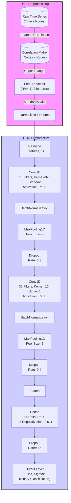

# System Architecture: Static CNN for ASD Detection

This document outlines the architecture of the system defined in `train_static_cnn.py`. The system processes time-series data to classify Autism Spectrum Disorder (ASD).

## Data Processing Pipeline

1.  **Input**: Time series data from CSV files (Shape: Time × Nodes).
2.  **Feature Extraction**:
    - Compute Pearson Correlation Coefficient (PCC) matrix between nodes.
    - Extract the upper triangle of the correlation matrix to remove redundancy and diagonal elements.
    - Flatten to a 1D feature vector.
3.  **Normalization**: Apply `StandardScaler` to normalize features across the dataset.

## CNN Model Architecture

The model is a 1D Convolutional Neural Network (CNN) implemented in TensorFlow/Keras.

## Layer Details

| Layer       | Output Shape                  | Parameters | Description                                                   |
| :---------- | :---------------------------- | :--------- | :------------------------------------------------------------ |
| **Input**   | `(Batch, Features)`           | 0          | Flattened upper triangle correlation features.                |
| **Reshape** | `(Batch, Features, 1)`        | 0          | Adds channel dimension for Conv1D.                            |
| **Conv1D**  | `(Batch, NewFeatures, 16)`    | _Variable_ | Features extraction. Kernel size 32, Stride 2.                |
| **Block 1** | `(Batch, PooledFeatures, 16)` | -          | Batch Norm -> MaxPool(2) -> Dropout(0.3).                     |
| **Conv1D**  | `(Batch, NewFeatures, 32)`    | _Variable_ | Deeper features. Kernel size 16, Stride 1.                    |
| **Block 2** | `(Batch, PooledFeatures, 32)` | -          | Batch Norm -> MaxPool(2) -> Dropout(0.4).                     |
| **Dense**   | `(Batch, 64)`                 | _Variable_ | Fully connected layer with L2 regularization.                 |
| **Output**  | `(Batch, 1)`                  | _Variable_ | Sigmoid activation for binary classification (ASD vs Normal). |
